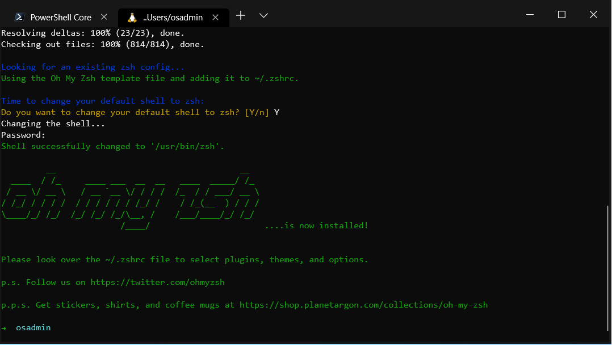
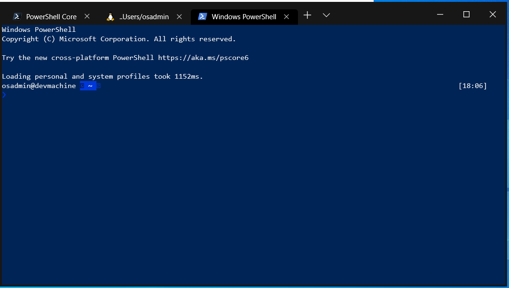
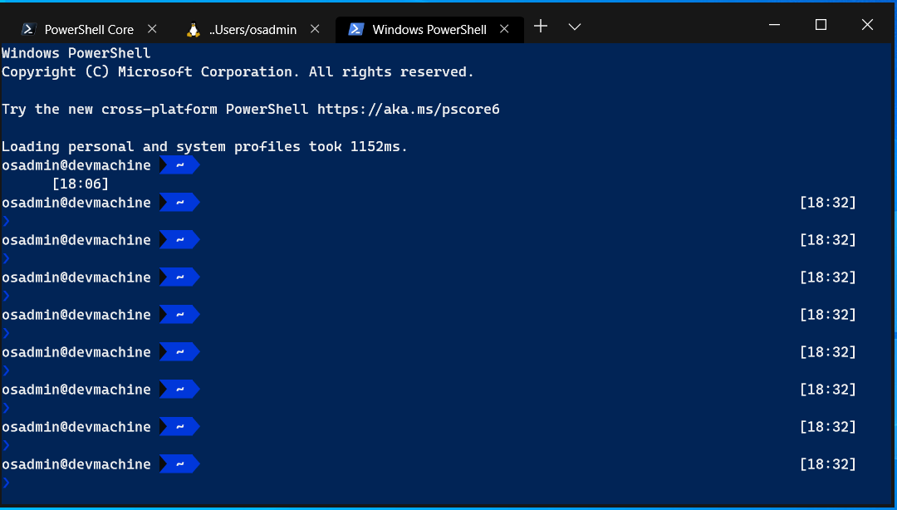

I have been using [Conemu](https://conemu.github.io/) as my goto terminal, i.e. till Micrsoft released the beta version of [Windows Terminal](https://github.com/microsoft/terminal). Windows terminal has a tabbed window which allows you to have multiple consoles at the same time, allows for a lot of customizations.

I have also become an afficiando of [Windows Subsystem for Linux (WSL)](https://docs.microsoft.com/en-us/windows/wsl/install-win10) ever since it made its appearance on Windows 10. I already blogged about the latest font called "Cascadia Code" released by microsoft and how you can use it in Visual studio code and other IDEs, you can read it [here](https://www.cloudmanav.com/tech/cascadia-code/#). In this blog I will take you through to the steps to beautify your terminals. 

## Bash on WSL

*"Oh My Zsh"* is a wonderful tool which comes bundled with thousands of helpful functions, helpers and plugins. 

1. Open the windows terminal and open tab for your WSL.
2. Run the following command.
```bash
sudo apt install zsh
```
3. Verify is the Z-shell has been installed by running the following command, output should show the version of the ZSH installed
```bash
zsh --version
```
4. Make Z-shell as the default shell so that each time you run bash it would load zsh
```bash
sudo chsh -s $(which zsh)
```
5. Install Oh-my-zsh
```bash
sh -c "$(curl -fsSL https://raw.github.com/robbyrussell/oh-my-zsh/master/tools/install.sh)"
```
Now the bash terminal would look something like this 


The configuration file would be stored in zshrc stored in the root directory, you could add themes and plugins as needed. I have uploaded my zshrc to this [gist](https://gist.github.com/772bdfe2c454dc7a816d878c477a23de), if you are looking for an example.

## Powershell or Powershell Core

*Oh-My-Posh* is windows version of *Oh-My-zsh*, it contains minimal but sufficient plugins and themes that would delight your experience with the terminal.

1. Open Powershell in the terminal 
2. Install the following modules
```powershell
Install-Module posh-git -Scope CurrentUser
Install-Module oh-my-posh -Scope CurrentUser
# This would be needed only if its Powershell Core
Install-Module -Name PSReadLine -AllowPrerelease -Scope CurrentUser -Force -SkipPublisherCheck 
```
3. Open the default profile using following command
```powershell
notepad $PROFILE
```
4. Add the following commands in the file opened in notepad
```powershell
Import-Module posh-git
Import-Module oh-my-posh
Set-Theme Paradox
```
Close and re-open the tab and you should be noticing your powershell modified.



You could change the themes as you deemed fit by modifying your profile.

## Glyphs and Nerd fonts

If you noticed the above image, the square boxes are because of the missing glyphs in the font used for the terminal. Cascadia code doesn't have all the glyphs and the nerd fonts patched, you can patch it yourself using the [Nerd fonts](https://www.nerdfonts.com/). 

I have already patched Cascadia code and you can download it [here](../assets/static/CascadiaCode-Nerd-Font-Complete.ttf)

Once you have downloaded the font and installed it, update the terminal font to *CascadiaCode Nerd Font*, your prompt should start looking like this now


Happy Coding!!!!